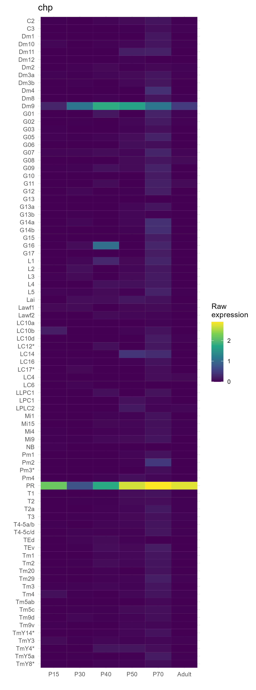
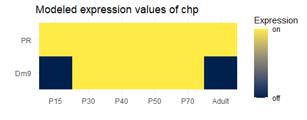
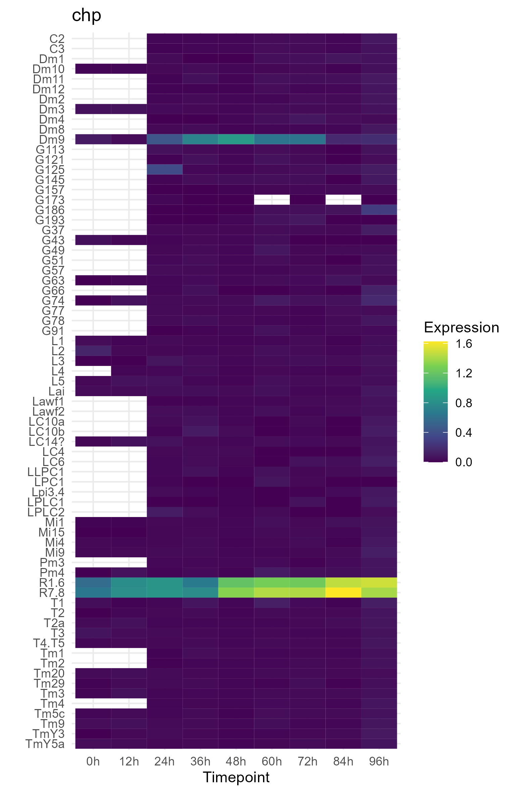

# Visualising scRNAseq gene expression data of developmental Dropophila optic lobe

This repo contains functions to visualise scRNAseq expression data of developmental Drosophila melanogaster optic lobe from **Desplan-lab** (corresponding publication <https://www.nature.com/articles/s41586-020-2879-3>) and for a similar study by the **Zipursky-lab** (corresponding publication: <https://pubmed.ncbi.nlm.nih.gov/33125872/>).

## Preparation of data 

#### Desplan dataset

Original data accessed at: <https://www.ncbi.nlm.nih.gov/geo/query/acc.cgi?acc=GSE142787>. The authors published two datasets:

-   log normalized raw expression data per cluster (*GSE142787_Log_normalized_average_expression.xlsx*)
-   binarized expression (*GSE142787_Mixture_modeling.xlsx*)\
    according to <https://elifesciences.org/articles/50901> binarized expression is more reliable descriptors of protein abundance in a cluster

The metadata (annotation of the clusters) is described in: *41586_2020_2879_MOESM4_ESM.xlsx*. These raw data can be merged and annotated using *0_prepare_data_Desplan.R* from this repository using tidyverse functions.

#### Zipursky dataset

Original data accessed at: <https://www.ncbi.nlm.nih.gov/geo/query/acc.cgi?acc=GSE156455>. The authors published two datasets:

-   early expression from pupal stages P0 to P24 (*GSE156455_matrix_early.mtx.gz*)
-   expression from pupal stages P24 to P96 (*GSE156455_matrix_main.mtx.gz*)

The metadata (annotation of the clusters) is described in: *GSE156455_tsne_early.tsv.gz* and *GSE156455_tsne_main.tsv.gz* respectively for clusters and *GSE156455_features_main.tsv.gz* for gene names.To create a single file with cluster-averaged and log-transformed expression values, first unzip the gz-files before executing the code in *0_prepare_data_Zipursky.R* from this repository using tidyverse functions. 

## Using the plotting functions

#### Desplan dataset 

*1_plot_expression_Desplan.R*

*plot_expression_raw()* will produce a heatmap of expression values over time for a gene of interest in all annotated clusters of the dataset.

*plot_expression_modeled()* will produce a heatmap of binarized expression values for a gene of interest for only those clusters, where at least one timepoint is predicted to express the gene.

The plots below show raw and modeled expression values for chaoptin (chp), a known photoreceptor-specific gene.

| |  |
|---------------------------------------------------------|------------------------------------------------------------------|

#### Zipursky dataset

*1_plot_expression_Zipursky.R*

*plot_expression_raw()* will produce a heatmap of expression values over time for a gene of interest in all annotated clusters of the dataset. The plot below shows raw expression values for chaoptin (chp), a known photoreceptor-specific gene.

